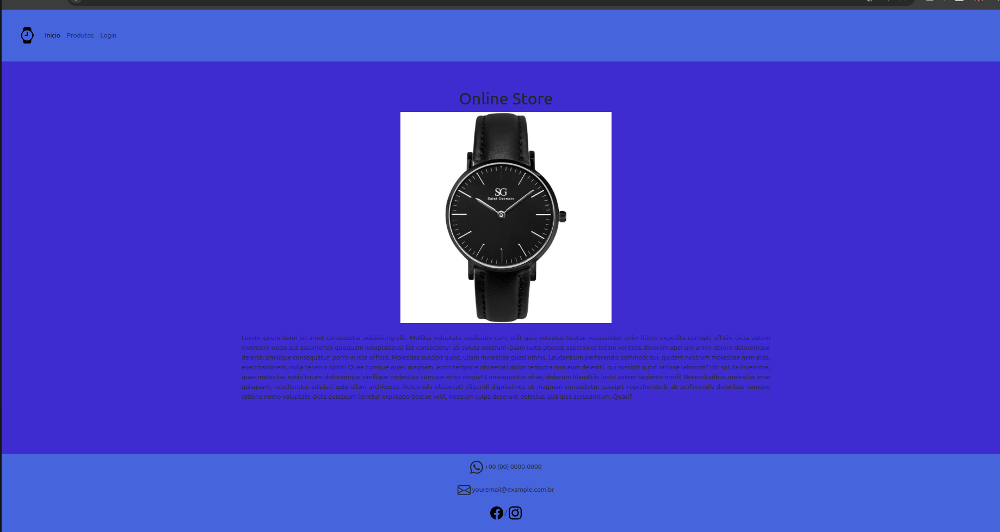
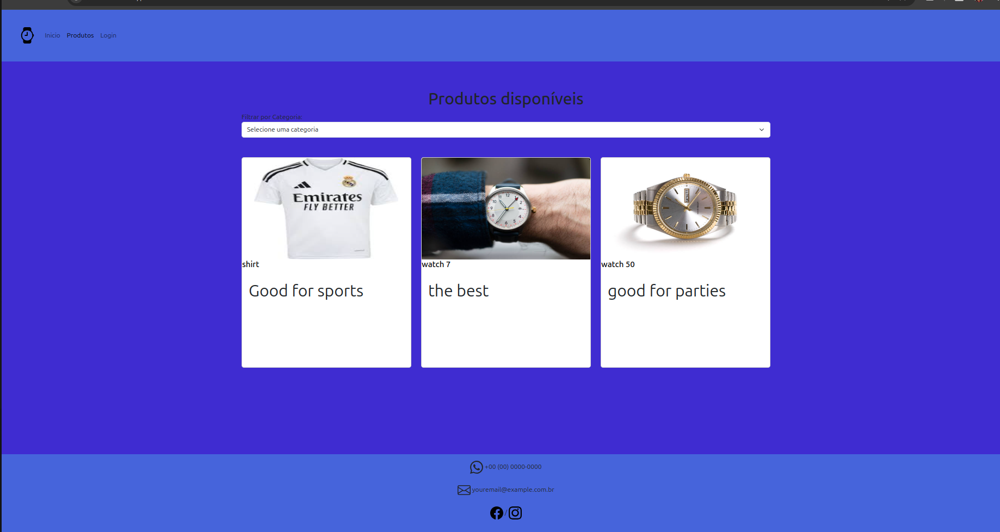
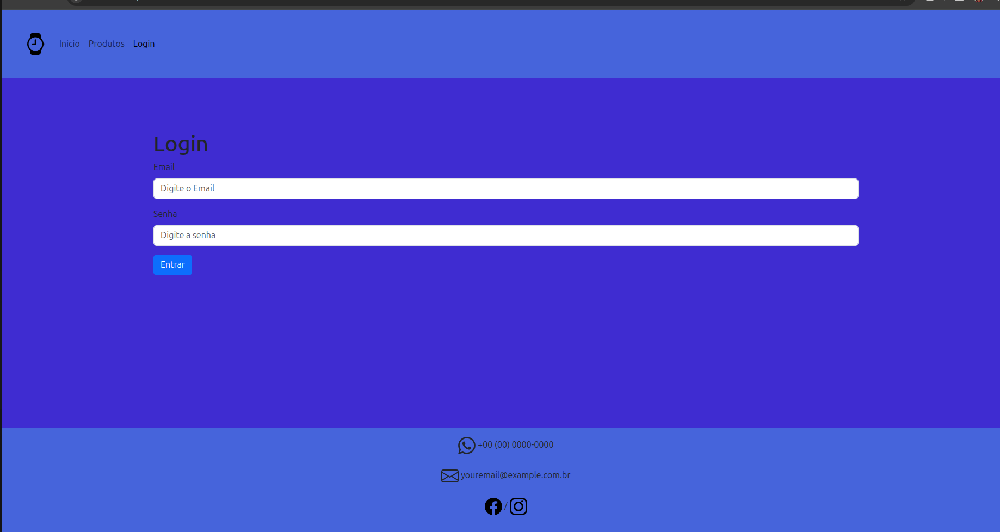
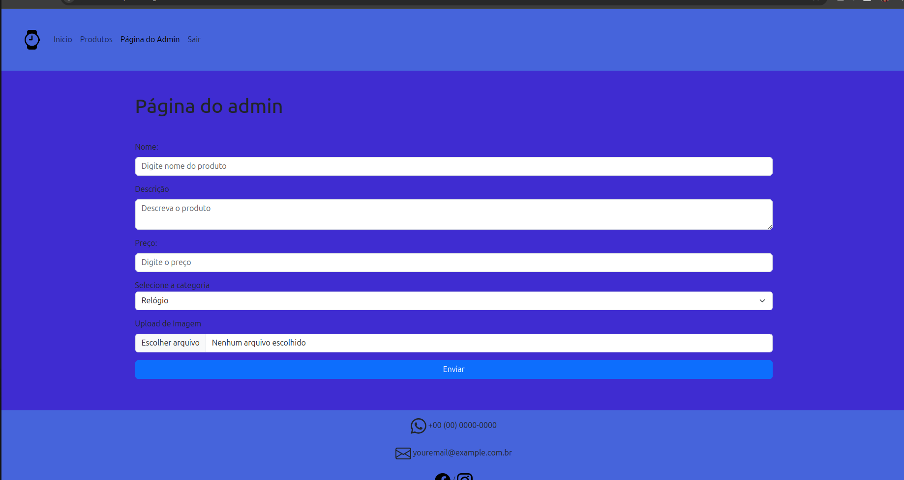
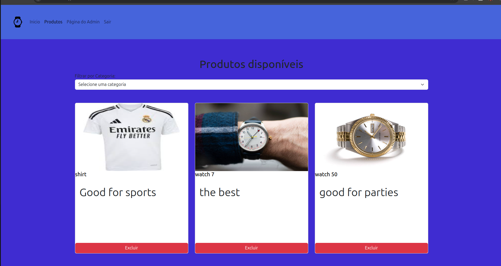
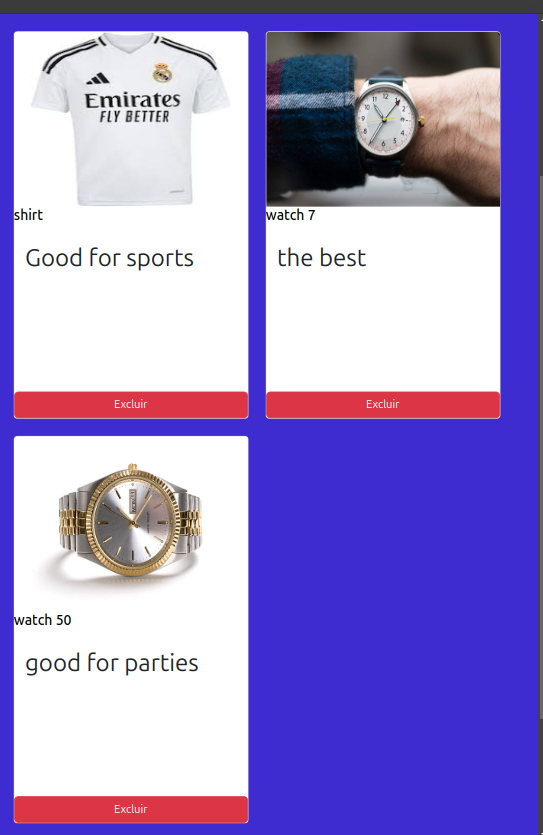
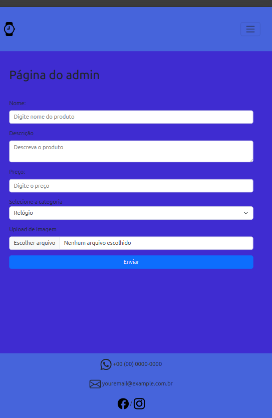
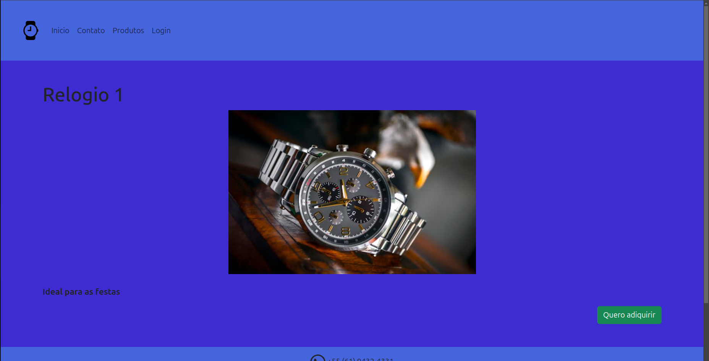
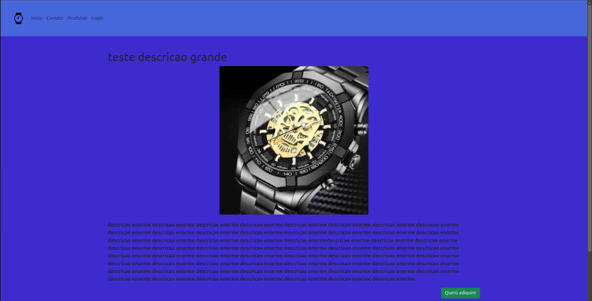

# Online Store - Product Management System

This project is an online store system where users can browse available products and contact the admin via WhatsApp for more details. Only the admin (a single user) has the ability to add or delete products from the store. The website is built with **Bootstrap** and is **responsive** to provide a seamless user experience on all devices.

## Description

This project is designed as a simple online store with the following features:

- **Product Display**: Users can view available products in the store.
- **Contact via WhatsApp**: When users click on a product, they are redirected to contact the admin via WhatsApp for more information or to make a purchase.
- **Admin Panel**: A single admin can log in, add new products, and delete existing ones.

The application is built using PHP, follows the Model-View-Controller (MVC) pattern, and utilizes a MySQL database to store product information.

## Technologies Used

- **PHP**: The core language used for the application logic.
- **MySQL**: Used for storing products and their details.
- **jQuery**: Used for frontend interactivity, such as form submissions and AJAX requests.
- **HTML/CSS**: Frontend for displaying products, using **Bootstrap** to ensure responsiveness.
- **WhatsApp API**: Redirects users to chat with the admin via WhatsApp when they click on a product.

## Installation

To run this project locally, follow these steps:

1. **Clone the repository**:

    ```bash
    git clone https://github.com/gabrielN1Santiago/online-store.git
    ```

2. **Navigate to the project directory**:

    ```bash
    cd projectname
    ```

3. **Set up your environment**:
    - Ensure that you have PHP and MySQL installed.
    - Import the provided database schema into your MySQL database.

4. **Install dependencies** (if applicable):
    - For PHP, there may be dependencies that can be installed via Composer or manually.

5. **Run the application**:
    - Start the PHP built-in server:

      ```bash
      php -S localhost:8000
      ```

    - Access the project in your browser at [http://localhost:8000](http://localhost:8000).

## Usage

Once the project is set up, users can:

- **View Products**: Visit `/products` to see all available products in the store.
- **Product Detail**: When a user clicks on a product, they are redirected to WhatsApp to contact the admin.
  
For the **Admin**:

- **Login**: Admin can log in at `/admin` using their credentials.
- **Admin Dashboard**: Once logged in, the admin can access the `/adminPage` to add or delete products.
- **Add Product**: The admin can add new products with details like name, category, price, description, and an image.
- **Delete Product**: The admin can delete products from the store.

### Key Pages and Routes

- **Home Page**: `/` — The landing page for the store.
- **Contact Page**: `/contact` — A contact page for the user to get in touch with the admin (with a WhatsApp link).
- **Product List**: `/products` — Displays all available products.
- **Product Detail**: `/product?id={productId}` — Shows details about a specific product, including a link to WhatsApp for contacting the admin.
- **Admin Login**: `/admin` — Admin login page.
- **Admin Dashboard**: `/adminPage` — Admin interface for managing products (adding and deleting products).
- **Logout**: `/logout` — Log out the admin.

## Admin Features


### Single Admin

This system is designed to be used by **only one administrator**. The admin has permission to add and remove products from the store. The admin account must be created manually through the MySQL command line.

#### How to add the admin

1. Open your MySQL database and access the database you are using for the project.
2. Run the following SQL command to create the admin account:

    ```sql
    INSERT INTO users (email, password) VALUES ('admin@example.com', MD5('yourpassword'));
    ```

    - Replace `'admin@example.com'` with the desired admin email.
    - Replace `'yourpassword'` with the desired admin password. **Note**: The password should be passed through MD5 encryption, as shown above.

This account will be the only one with access to the admin panel for managing store products.

#### Admin Access

- **Login**: The admin can access the admin panel through the `/admin` page by entering the registered email and the password (which is MD5-encrypted).
- **Admin Dashboard**: After logging in, the admin will be redirected to the dashboard where they can add, edit, or delete products.


#### Authentication

The admin system requires login:

- **Login**: Admin logs in using their email and password.
- **Logout**: Admin can log out at any time, which will redirect them to the login page.

#### Product Management

- **Add Product**: Admin can add products to the store with the following details:
  - Name
  - Category
  - Price
  - Description
  - Image
- **Delete Product**: Admin can delete products from the store and their associated images.

## Error Handling

The system includes error messages for the following cases:
- **Login Failure**: If the admin enters incorrect credentials, an error message is displayed.
- **Adding Product**: If an error occurs while uploading a product image.
- **Deleting Product**: If an error occurs while deleting a product or its image.

## Contributing

If you'd like to contribute to this project, follow these steps:

1. Fork the repository.
2. Create a new branch for your feature (`git checkout -b feature-name`).
3. Make your changes and commit them (`git commit -am 'Add new feature'`).
4. Push your branch to the repository (`git push origin feature-name`).
5. Open a pull request.

## Contact

If you have any questions or suggestions, feel free to reach out to me:

- **Email**: gabrielnobresantiago123@gmail.com
- **GitHub**: [https://github.com/gabrielN1Santiago](https://github.com/gabrielN1Santiago)

---
<p align="center">
    <br />
    <br />
    <br />
    <br />
    <br />
    <br />
    <br />
    <br />
    
</p>